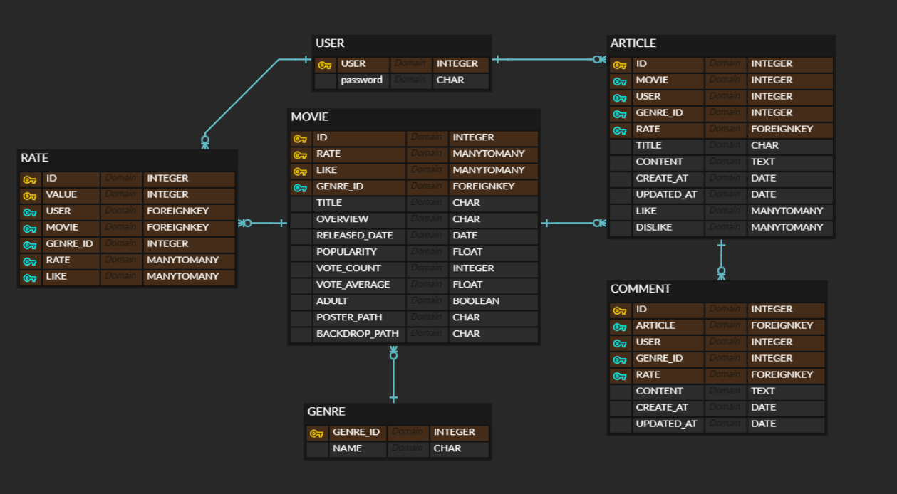

# 1학기 최종 pjt

> Vue는 큰 산이었다고 한다.

- 초반 3일간 큰 틀을 작성하고 시리얼라이즈의 작동 방식을 연구함
- Vue.js에서는 그냥 `views.py` 에서 `.vue`만으로 코드를 작성하였음(`components`사용 X)
- 코드를 대충 완성하고 **정상 작동을 확인**했지만 자고 일어나면 에러가 발생하여 작동이 안 되는 경우가 허다하였음(merge하여 오류나는 것도 파다하였음)
- 큰 기능의 구현이 어느 정도 마무리되었을 때, 느낀 바지만 작은 기능(기성 페이지들의 편의기능)들도 큰 기능 못지 않게 중요하다는 것을 배웠음
- **그래도 Vue에 대해 이해력이 올라간 첫 프로젝트 경험~**
- 

## 서버측 (Django로 구현) - movieBack

- 계정(accounts) : rest-auth로 구현, Serializer의 속성값에 다른 모델로부터 참조된 Foreignkey, ManyToManyField의 related_name을 입력
- 커뮤니티(community) : 영화별 커뮤니티를 구현, 게시글과 그 댓글 테이블을 구성함
- 영화(movie) : 장르와 영화, 사용자의 영화평가 테이블을 구성함
- 시리얼라이즈가 어떤 역할을 하는 지 배웠음, 쿼리셋을 브라우저가 읽을 수 있게 해주는 도구
- 마지막 날, 브라우저에서 쿼리셋을 읽어들이는데, `objects`가 와야하는데 `Array`가 왔다고 해서 props의 항목을 `Array`로 해서 다시 작동시키면 `Objects`가 왔다고 하고 이해할 수 없는 일이 있었음
- 

## 화면측 (Vue.js로 구현) - movieFront

- 현 프로젝트는 그냥 views의 `.vue`를 생성하여 코드를 작성했기에 `components`를 이용했더라면 더 간결한 코드 작성과 디버깅에 이점이 있었을 터임..
- 5~6일차에 어느 정도 구현을 했지만, 자꾸 에러가 나는 현상을 맞이함, 디버깅을 하는데 하루를 다 쓰기도 했음
- `$emit`으로 정보를 요청했을 때, user의 id값을 활용해 username을 받아오려했으나, 결국은 요청할 모델에 `username` 속성을 만들어 활용하는 편이 더 좋은 방법이었음.
- 